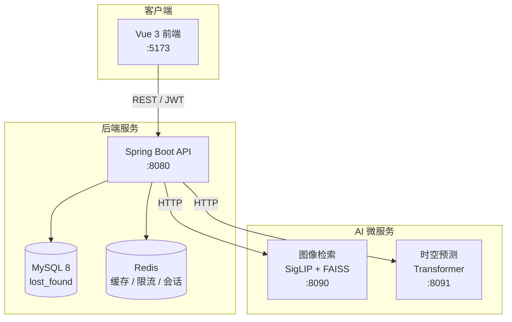
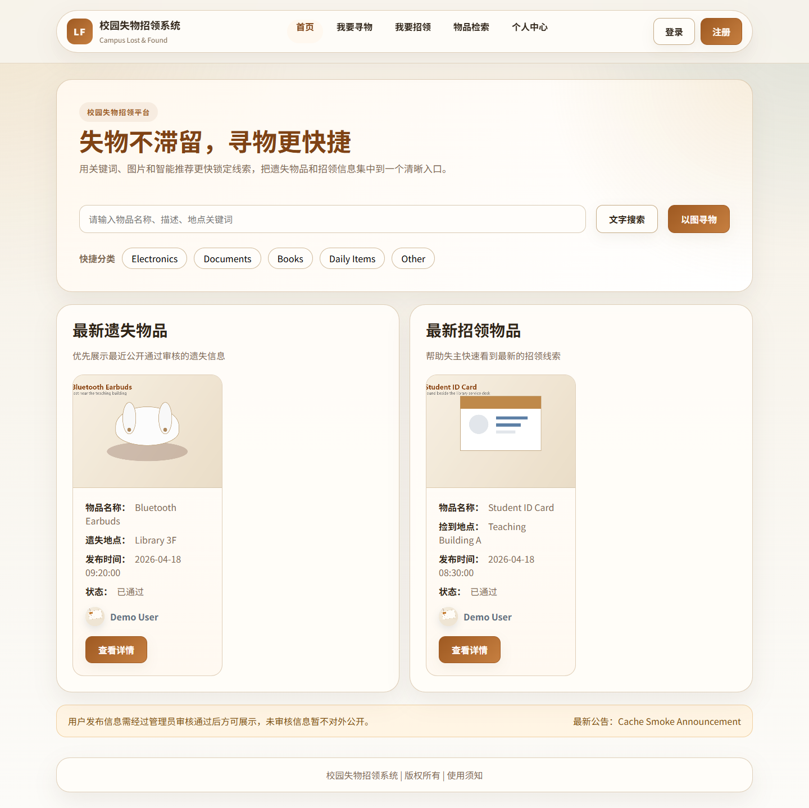
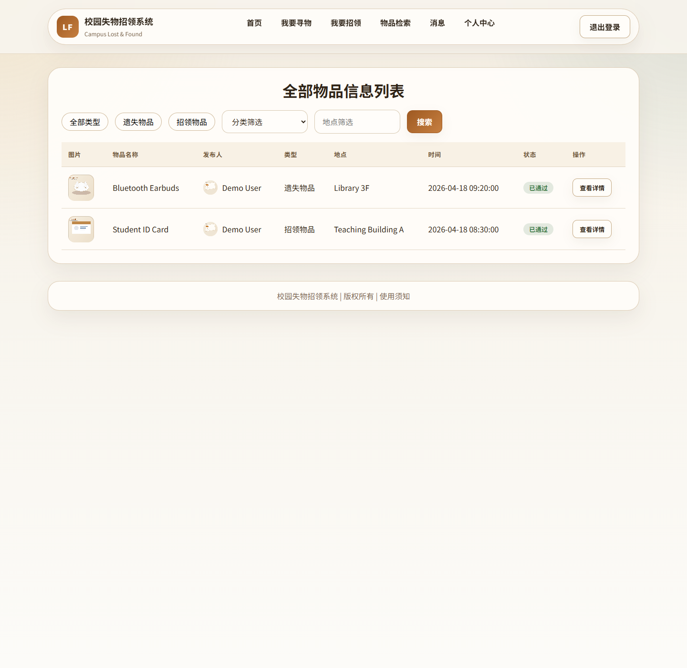
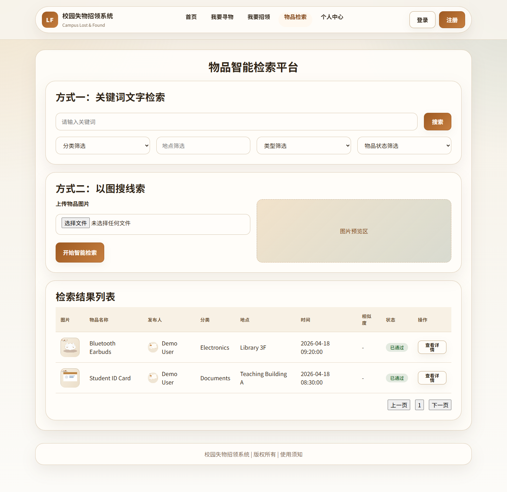
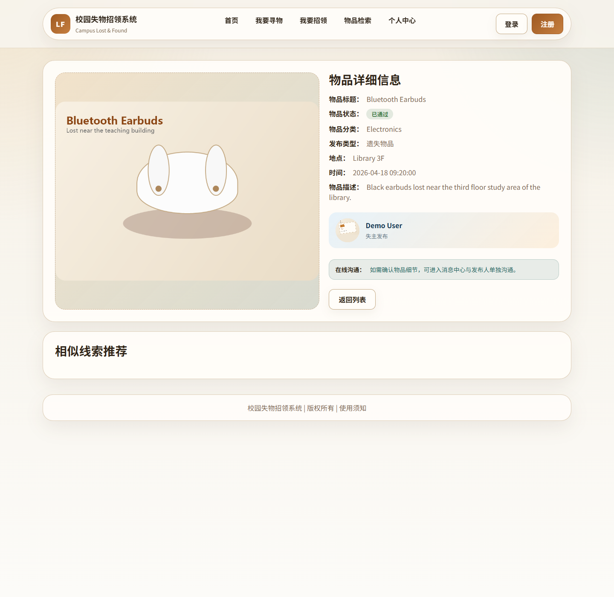
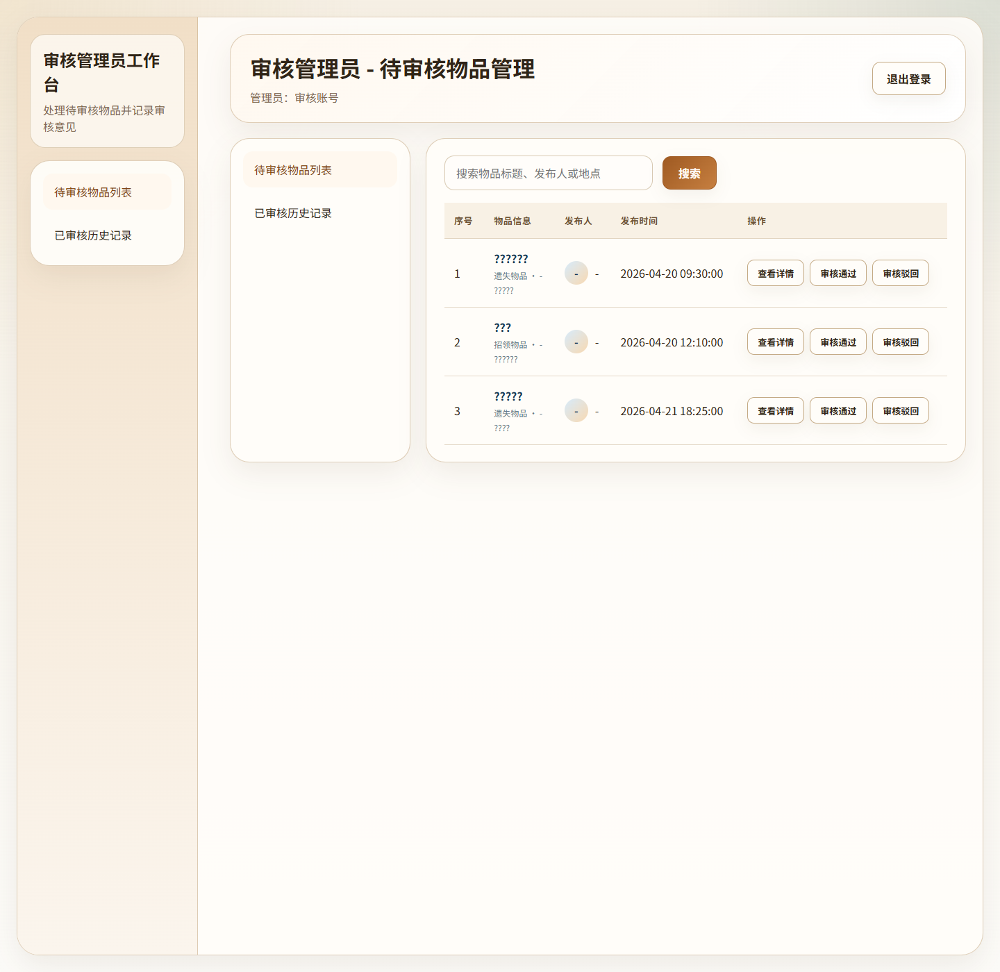

# 校园失物招领系统

> 基于图像检索与时空预测算法的校园失物招领平台 · 毕业设计项目

[](https://openjdk.org/)
[](https://spring.io/projects/spring-boot)
[](https://vuejs.org/)
[](https://www.python.org/)
[](https://www.mysql.com/)
[](#)

---

## 项目简介

本系统面向校园场景，解决失物信息分散、文字描述难以匹配、管理端缺少数据分析等问题。平台集 **信息发布、审核认领、智能检索、时空预测、消息通知** 于一体，采用前后端分离架构，并接入两个 Python AI 微服务：

| 模块 | 说明 |
|------|------|
| **图像检索** | 基于 SigLIP + FAISS，支持「以图搜物」与文字搜图 |
| **时空预测** | 基于 Transformer，预测下一高发地点与时段，辅助管理决策 |

---

## 功能概览

### 用户端

- 注册 / 登录（图形验证码 + JWT 鉴权）
- 首页浏览、失物 / 拾物列表与详情
- 发布失物信息、发布拾物信息
- 关键词搜索 + 图像智能匹配
- 认领申请、个人中心、消息中心

### 管理端

| 角色 | 能力 |
|------|------|
| **审核管理员** | 待审列表、审核历史、认领处理 |
| **系统管理员** | 数据看板、失物 / 拾物管理、用户管理、公告管理、账号管理 |

### AI 能力（可选启动）

- **图像检索服务**（`:8090`）：上传图片或输入文字，检索相似失物 / 拾物记录
- **时空预测服务**（`:8091`）：根据历史事件序列，预测下一可能地点与时间窗口

---

## 系统架构



---

## 技术栈

| 层级 | 技术 |
|------|------|
| **后端** | Spring Boot 3 · Spring Security · MyBatis-Flex · JWT · Redis · MySQL 8 |
| **前端** | Vue 3 · Vite · Vue Router · Pinia · Element Plus · Axios |
| **图像检索** | FastAPI · PyTorch · SigLIP · FAISS |
| **时空预测** | FastAPI · PyTorch · Transformer |
| **工程化** | Maven · npm · Docker 友好分层 · Actuator 监控 |

---

## 目录结构

```text
Lost-and-Found/
├── backend/                  # Spring Boot 后端
│   ├── src/main/java/        # 控制器、服务、实体、安全等
│   ├── src/main/resources/   # 配置文件
│   ├── sql/                  # 增量 SQL 脚本
│   └── uploads/demo/         # 演示图片资源
├── frontend/                 # Vue 3 前端
│   └── src/
│       ├── pages/            # 页面（用户端 + 管理端）
│       ├── api/              # 接口封装
│       └── components/       # 布局与公共组件
├── python-image-search/      # 图像检索微服务
├── python-spatiotemporal/     # 时空预测微服务
├── docs/                     # 运行指南、设计文档
├── frontend-screenshots/     # 界面截图
└── database.sql              # 数据库建表与种子数据
```

---

## 快速开始

### 环境要求

| 组件 | 版本 |
|------|------|
| JDK | 17+ |
| Maven | 3.9+ |
| Node.js | 18+ |
| MySQL | 8.0+ |
| Python | 3.8+（AI 服务可选） |
| Redis | 推荐（缓存、验证码、限流） |

### 1. 初始化数据库

```sql
CREATE DATABASE lost_found
  DEFAULT CHARACTER SET utf8mb4
  COLLATE utf8mb4_0900_ai_ci;
```

导入项目根目录的 `database.sql`。

### 2. 启动后端

```bash
cd backend

# 可通过环境变量覆盖数据库与 JWT 配置
# DB_URL / DB_USERNAME / DB_PASSWORD / JWT_SECRET

mvn spring-boot:run
```

后端默认地址：`http://localhost:8080`

健康检查：`http://localhost:8080/actuator/health`

### 3. 启动前端

```bash
cd frontend
npm install
npm run dev
```

前端默认地址：`http://localhost:5173`

可选：在 `frontend/.env.local` 中配置：

```bash
VITE_API_BASE_URL=http://localhost:8080/api
VITE_BACKEND_ORIGIN=http://localhost:8080
```

### 4. 启动 AI 服务（可选）

**图像检索**

```powershell
cd python-image-search
py -m venv .venv
.\.venv\Scripts\activate
pip install -r requirements.txt
.\run.ps1
# 默认 http://localhost:8090
```

**时空预测**

```powershell
cd python-spatiotemporal
py -m venv .venv
.\.venv\Scripts\activate
pip install -r requirements.txt
.\run.ps1
# 默认 http://localhost:8091
```

> 不启动 AI 服务时，主站仍可正常使用；智能匹配与时空预测功能将不可用。

更详细的步骤见 [docs/run-guide.md](docs/run-guide.md)。

---

## 演示账号

数据库种子数据中预置以下账号（密码以本地 `database.sql` 为准，请勿在公开环境使用弱密码）：

| 用户名 | 角色 |
|--------|------|
| `demo` | 普通用户 |
| `reviewer` | 审核管理员 |
| `sysadmin` | 系统管理员 |

若登录异常，建议重新导入 `database.sql` 到干净的 `lost_found` 库。

---

## 界面预览

| 首页 | 物品列表 | 智能搜索 |
|:----:|:--------:|:--------:|
|  |  |  |

| 物品详情 | 审核待办 | 管理看板 |
|:--------:|:--------:|:--------:|
|  |  |  |

---

## 文档

| 文档 | 内容 |
|------|------|
| [docs/run-guide.md](docs/run-guide.md) | 本地运行、构建验证、验证码与登出测试 |
| [docs/system-design.md](docs/system-design.md) | 功能设计、数据库设计、API 设计 |
| [docs/project-summary.md](docs/project-summary.md) | 项目定位、亮点与演示流程 |
| [docs/python-image-search-service.md](docs/python-image-search-service.md) | 图像检索服务说明 |
| [docs/python-spatiotemporal-module.md](docs/python-spatiotemporal-module.md) | 时空预测模块说明 |

---

## 项目亮点

1. **前后端分离**，后端标准分层（Controller → Service → Mapper → Entity）
2. **JWT + BCrypt** 鉴权，支持服务端登出、强制下线与图形验证码
3. **Redis** 用于缓存、限流、幂等控制与会话黑名单
4. **双 AI 微服务** 独立部署，通过 HTTP 与主后端解耦
5. **完整交付物**：数据库脚本、演示数据、运行文档、界面截图

---

## 作者

**盛中华** · 沈阳化工大学 · 2216020128

指导教师：姜楠

---

## License

本项目为毕业设计作品，仅供学习与交流使用。
